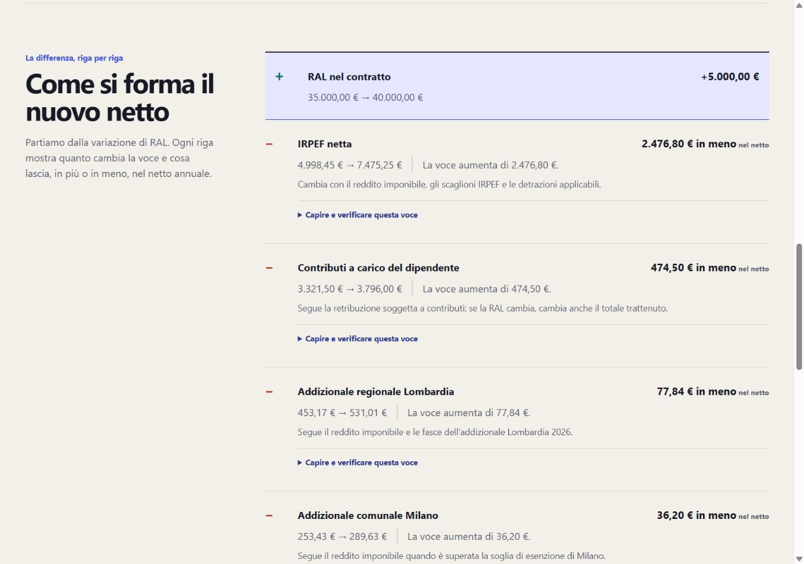

# Netto

**Gross compensation, translated into disposable consequences.**

Netto is an Italian salary-transparency product. It answers two questions: _what does my RAL become?_ and _what is a compensation change actually worth?_ The result is immediate; the fiscal reasoning remains inspectable down to formulas, rule IDs, and official sources.

[**Try the live product →**](https://netto-c2o.pages.dev/)

> _Capire lo stipendio, prima di accettarlo._ The interface is Italian because it models Italian compensation and preserves the terminology employees encounter in contracts, payroll, and institutional sources. Code and engineering documentation are English-first for technical review.



## The product decision

Most gross-to-net calculators stop at an output. Netto treats the calculation as an explanation.

For a representative `€35,000 → €40,000` change, Netto shows that:

- `+€5,000` in contractual RAL becomes `+€1,934.66` annual net;
- that is `+€161.23` average monthly net;
- `38.69%` of the gross change is reflected in disposable income;
- each contribution, tax, and benefit exposes its **before/after amount**, **component change**, **effect on net**, and **fiscal driver**.

The comparison is not two calculators or a guessed marginal rate. It is a cent-reconciled comparison of two canonical fiscal results. Try `35.000 → 40.000`, then reverse it or compare `20.000 → 25.000` to see rule applicability change.

## A deliberately bounded estimate

Netto V1 models fiscal year 2026 for an ordinary, permanent, full-year private-sector employee in Milan, Lombardy, under the documented industrial CIGO/CIGS profile. RAL is accepted in whole euros from **€10,000 through €120,000**.

It is an annual estimator—not payroll, tax-filing, or CCNL-compliance software. Personal deductions, dependants, other income, special pay regimes, benefits, TFR, and other fiscal profiles are intentionally excluded. Unsupported rules are recorded as exclusions, never silently treated as zero.

[Read the full product and assumption contract](docs/product/product-spec.md).

## Why the numbers are trustworthy

```text
typed 2026 input
      ↓
pure TypeScript fiscal engine
      ↓
canonical amount registry + calculation trace
      ↓
single result, comparison, explanations, and accessibility output
```

- `calculateSalary2026` is the only fiscal authority; React contains no tax formula.
- `decimal.js` stays behind a domain-owned adapter. Public money is safe integer euro cents.
- Component-first normalization guarantees that displayed totals equal displayed components.
- 15 human-approved fiscal rules trace to official sources; nine exclusions preserve the V1 boundary.
- Every one of the 110,001 supported whole-euro RAL values is exercised by an exhaustive deterministic gate.
- Salary data stays in the browser: no backend, analytics, persistence, remote fiscal API, or third-party runtime script.

The runtime dependency surface is only React, React DOM, and `decimal.js`.

## Engineering evidence, without the archaeology

Start here if you want to inspect the work:

1. [Architecture](docs/architecture/architecture.md) — boundaries, numeric ownership, and rejected complexity.
2. [2026 Fiscal Rule Catalog](docs/domain/fiscal-rules-2026.md) — verified rules, explicit exclusions, and implementation semantics.
3. [2026 Source Register](docs/domain/source-register-2026.md) — provenance from INPS, Agenzia delle Entrate, legislation, Regione Lombardia, Comune di Milano, and MEF.
4. [Test Strategy](docs/testing/test-strategy.md) — rule boundaries, golden fixtures, reconciliation, UI, accessibility, and exhaustive validation.
5. [AI Engineering Workflow](docs/ai-engineering/workflow.md) — bounded roles, evidence contracts, independent review, and human approval gates.

`PROJECT_STATE.md` is the operational snapshot; deeper ADRs and concise run records remain available for reviewers who want the full decision history.

## AI-assisted, judgment-owned

Codex and Claude Code accelerated research, implementation, and review, but repository evidence—not chat context—owned the result. The useful signal is the correction loop:

- uncertain fiscal mechanics were excluded instead of invented;
- independent reviewers challenged research, money policy, domain code, UX, and release behavior;
- canonical numeric ownership prevented a visualization or comparison from becoming a second calculator;
- completed UI work was replaced when it was correct but insufficiently clear;
- no backend, charting system, global state library, analytics, or speculative fiscal scope was added.

AI increased execution capacity. Human decisions set scope, accepted fiscal truth, and determined when to delete, simplify, and ship.

## Run locally

Node `22.23.2` and npm `10.9.8` are declared by the repository.

```bash
npm ci
npm run dev
```

The GitHub Actions quality gate runs strict types, lint, formatting, Vitest, exhaustive domain validation, production build/artifact checks, dependency audit, and Playwright/axe journeys. Cloudflare Pages serves the same static build with restrictive security headers and no runtime secrets.

---

**Live product:** [netto-c2o.pages.dev](https://netto-c2o.pages.dev/)<br>
**Current scope:** Italy · Milan/Lombardy · 2026 · €10k–€120k · documented employee profile
